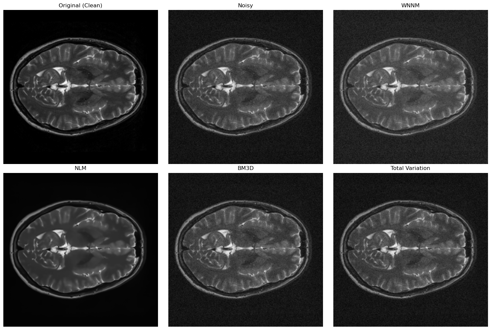
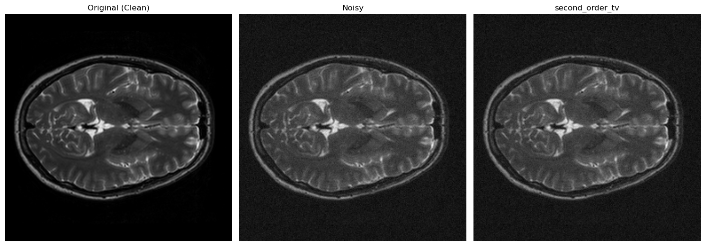
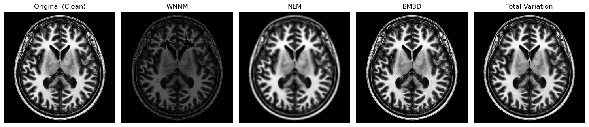

# Classic Denoising

In this repo we investigate classic denoising methods. 
Our focus is on `Non-Local Means (NLM), BM3D, Total Variation (TV), Weighted Nuclear Norm Minimization (WNNM)`<br>
Find more detailed analysis in notebook! 

## Adding Noise
additive Gaussian noise with an average of zero and a deviation from a standard equal to 0.02 of the maximum brightness available in a set of 130 images

## Denoising
<p align="center">
    
</p>

```
WNNM PSNR: 16.21 dB
NLM PSNR: 37.32 dB
BM3D PSNR: 33.40 dB
TV PSNR: 33.47 dB
```
## Second order TV
<p align="center">
    
</p>

```
Average second_order_tv_psnr: 33.52 dB
```
## Denoising clean image
here we use the *Prob#1.png* image without adding noise as the input of the denoising methods:
<p align="center">
    
</p>

```
WNNM PSNR: 30.66 dB
NLM PSNR: 8.06 dB
BM3D PSNR: 111.51 dB
TV PSNR: 8.06 dB
```
